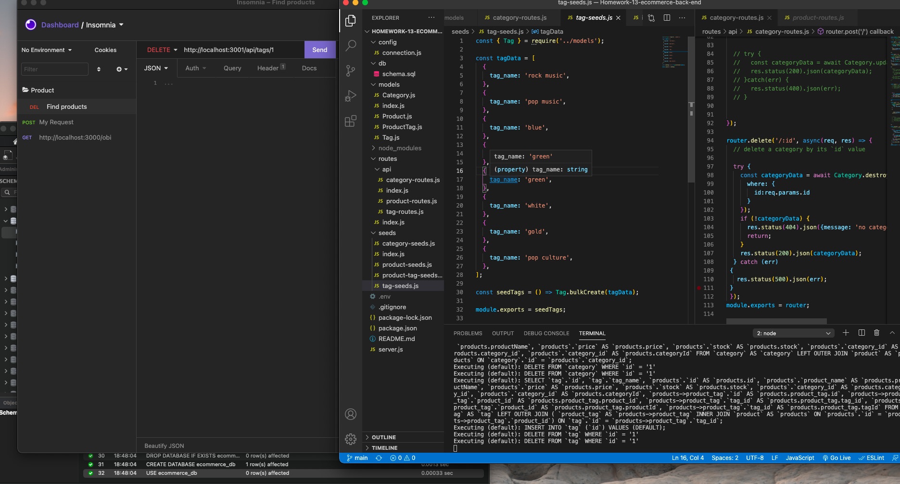

# Homework-13-ecommerce-back-end
This project utilizes Object Relational Mapping. The application is tested using Insomnia to show proper output for each of the API routes and our database is seeded in MySQL. The products, tags, and categories are tested and showing output through Insomnia. 

